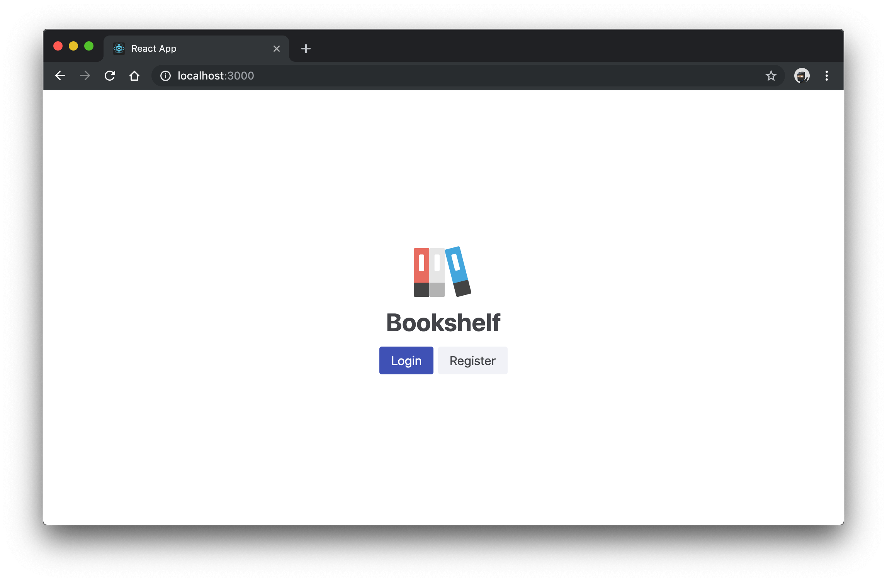
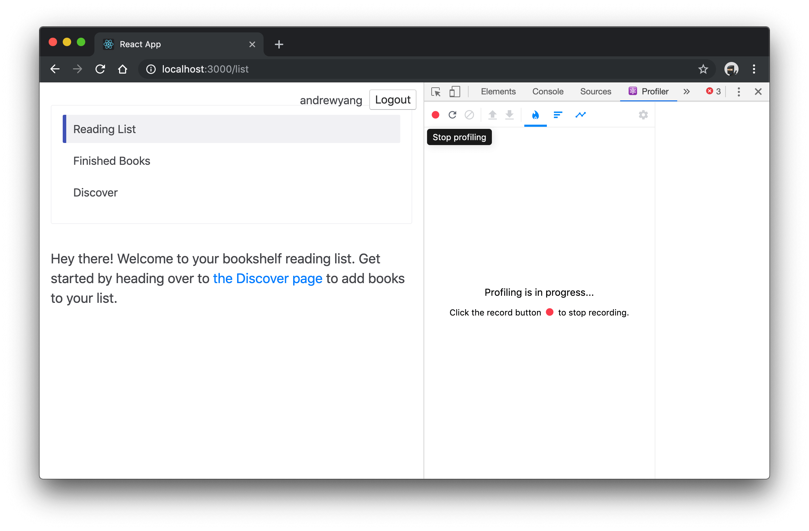
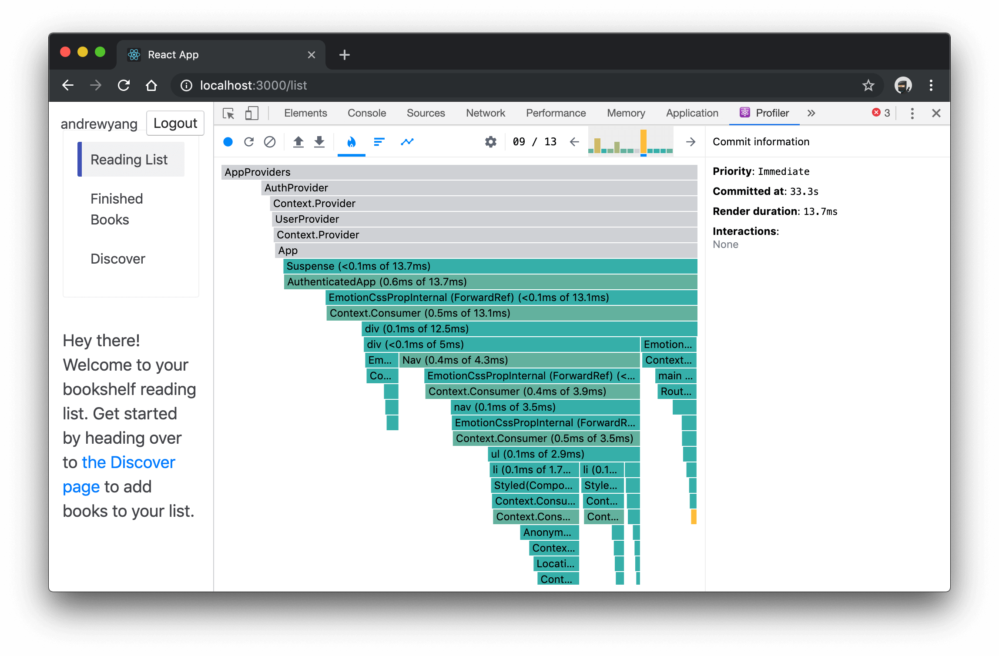
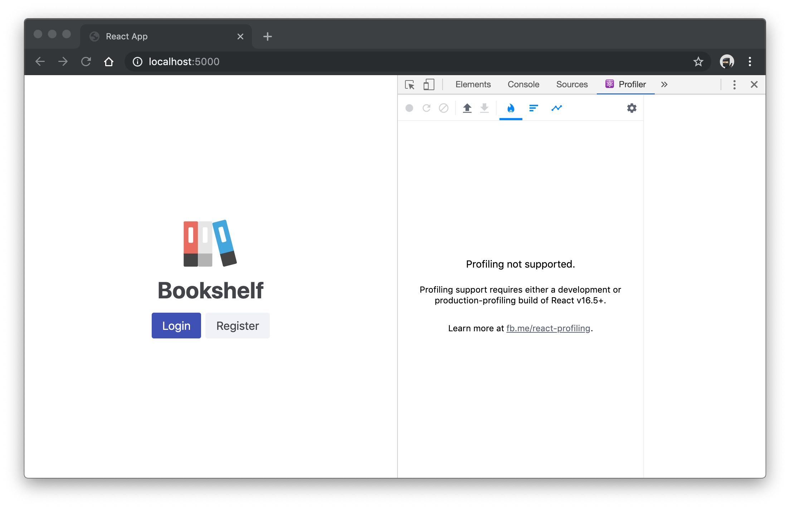
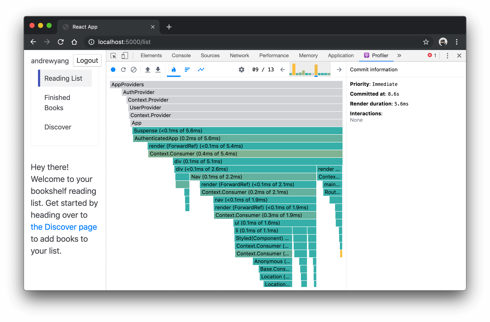
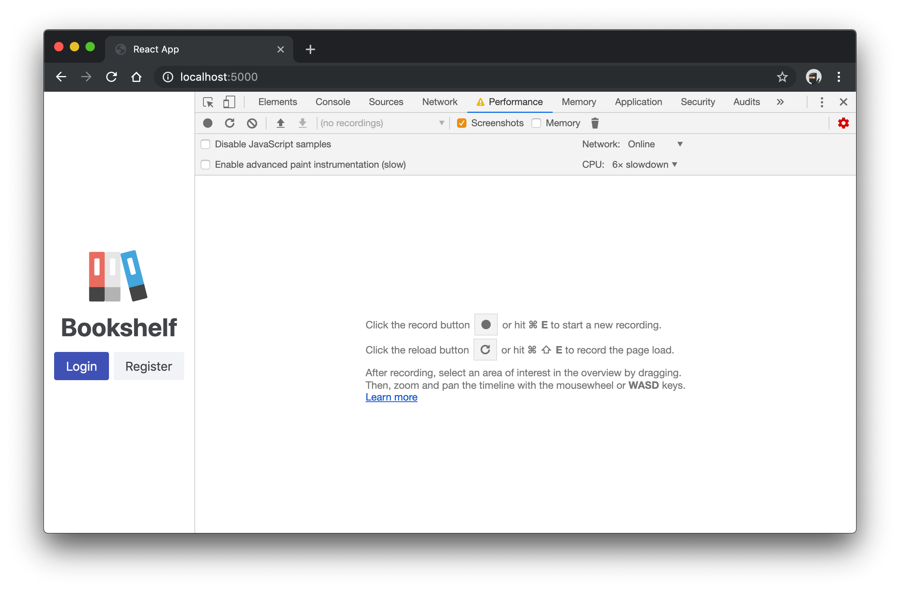
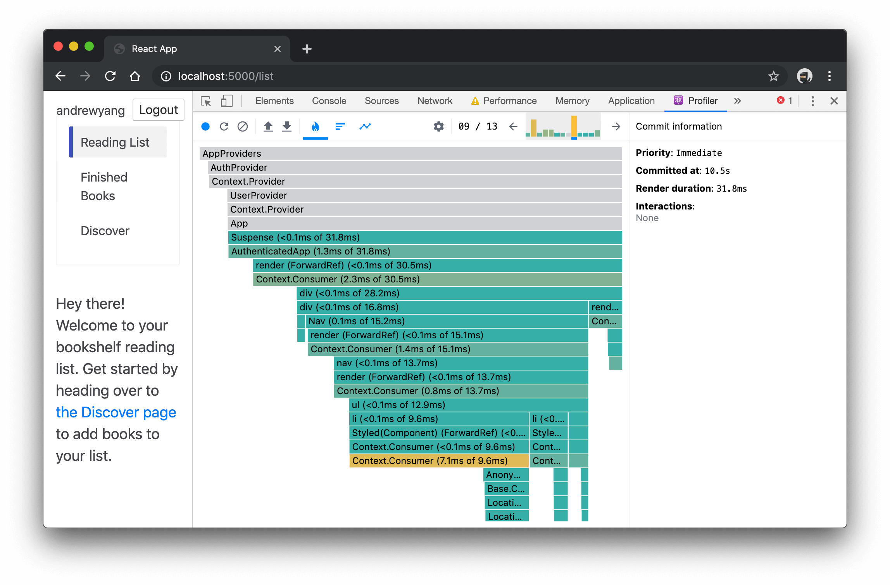

[The React DevTools](https://github.com/facebook/react/tree/master/packages/react-devtools)
is an amazing piece of software and is available as a browser extension for
[Chrome](https://chrome.google.com/webstore/detail/react-developer-tools/fmkadmapgofadopljbjfkapdkoienihi?hl=en),
[Firefox](https://addons.mozilla.org/en-US/firefox/addon/react-devtools/), and
is capable of being wired up to work with React app's anywhere.

One of the coolest features of the React DevTools is it's profiling
capabilities. There's a lot to the profiler, and we're not going to get into it
all in this post, but I thought I'd show you how you can get started using the
React Profiler and avoid a common pitfall people run into when profiling their
applications.

I'm going to be working with
[my bookshelf app](https://github.com/kentcdodds/bookshelf) which does a good
job of walking the line between practical enough to be "real world" but simple
enough to not require a lot of domain specific knowledge to understand. Feel
free to follow along if you'd like, or (even better) follow along in your own
project.

## Install the Extension

First step is to make sure you install the React DevTools extension for the
browser you're using. I'm using Chrome, so I installed it
[in the Chrome WebStore](https://chrome.google.com/webstore/detail/react-developer-tools/fmkadmapgofadopljbjfkapdkoienihi?hl=en).
If it's not appearing after you install the extension, you may need to close
your browser DevTools panel and open them again.

## Start the app

The bookshelf app uses `react-scripts` (thanks to `create-react-app`), so after
you've installed the project locally, run `npm run start` to get the development
server running. This will pull up the app in your browser at
`http://localhost:3000`:



## Start a profiling session

Open the browser developer tools by right clicking anywhere on the page and
clicking "Inspect." Then select the "⚛ Profiler" tab. This is the React DevTools
profiler and you can now click the little blue circle to "Start profiling" the
application.


From here go ahead and interact with the app a bit. I'm going to register for a
new account. Then click the little red circle to "Stop profiling."



## Explore the profiling data

From here you've got a few options for exploring the data that the DevTools
collected while you interacted with the app. The default view is the "Flamegraph
chart", and there's also the "Ranked chart." Here's what the "Flamegraph chart"
looks like (if you want to see the "Ranked chart," you'll have to do this
yourself 😜):



We can dive into analyzing this stuff in another post.

## Pitfall: measuring development mode

I want to call out a serious pitfall that you need to avoid when doing
performance measurements like profiling. Right now we're measuring how our app
performs in development mode. If you've been using React for a while, you're
likely well aware that it ships with a lot of development-time warnings to help
guide you away from problematic code and practices. This is one of the things I
love most about React, but that comes at a (often significant) performance cost.

Because of this, your performance measurements are tainted by React's
development-time-only code (something your users shouldn't ever be running).

So if you want to get an accurate measurement of your app's production
performance, you should be sure to do your measurements on the production
version of your code (the code that your end-users will be using).

### Build and measure the production app

So let's run the optimized production build with `npm run build`. Next we'll run
`npx serve -s build` to serve up the built version of the app on an HTTP server.
That should start the app on port 5000. So let's pull that up and start a
profiling session on that... Wait! Oh no! What's this?



> Profiling not supported.
>
> Profiling support requires either a development or production-profiling build
> of React v16.5+.
>
> Learn more at [fb.me/react-profiling](https://fb.me/react-profiling).

As it turns out, React has code in it that's specific to profiling and in the
interest of making your app as fast as possible, they actually remove that code
from the production build of React. Thanks React! Except now what do we do?
Well, I guess we could go to the linked gist by Brian! Or you could continue
reading and I'll show you what to do.

**NOTE: If you're using create-react-app** with `react-scripts@>=3.2.0` then you
can simply run `npx react-scripts build --profile` and it will do all this stuff
for you
([thanks to Jacob](https://github.com/facebook/create-react-app/pull/7737)) and
you can skip to the next pitfall. Otherwise, please read on.

### Update the webpack config for production-profiling

As noted in the message, there's a production build of React that removes most
of the development-time helpful code, but leaves the profiling code in-tact.
It's still a tiny bit slower, but it gives us the best idea of how our
components are performing in a production environment.

There are a few ways to go about this, but the simplest is to update the webpack
configuration to alias any import of certain modules to the profiling version of
that module. There are two such modules:

- `react-dom` -> `react-dom/profiling`
- `scheduler/tracing` -> `scheduler/tracing-profiling`

Both of these are React packages and need special code for the profiler to work.

How you go about updating your webpack configuration will vary based on what
framework you're using (create-react-app, next.js, gatsby.js, or your own with
raw webpack). In our case, we're using create-react-app and there's not an
officially supported way to extend or modify the webpack configuration. Luckily
for us, this is only something we want to do locally, so we're going to do a
little [spelunking in our `node_modules`](/blog/spelunking-in-node-modules).

So, if you're using `react-scripts@3.1.1` (or somewhere around there), then you
can open the webpack config here:
`./node_modules/react-scripts/config/webpack.config.js`

Then locate the code that looks like this and add the noted lines:

```javascript {8-9}
// ... config ...
resolve: {
  // ... config ...
  alias: {
    // Support React Native Web
    // https://www.smashingmagazine.com/2016/08/a-glimpse-into-the-future-with-react-native-for-web/
    'react-native': 'react-native-web',
    'react-dom$': 'react-dom/profiling',
    'scheduler/tracing': 'scheduler/tracing-profiling',
  },
  // ... more config ...
}
// ... more config ...
```

### Profile the production-profiling build

Great, now run `npm run build`, then `npx serve -s build` and let's profile the
app again! I'll follow the same registration steps I did last time. Here's what
I came out with:


Nice! You'll notice that this is the same interaction as the last time (it's
rendering the page after registration) and we went from 13.7ms to 6.5ms. Nice
improvement!

But uh oh, what's this `Anonymous` component thing all over the place? And we've
got a component called `ee` another called `Z`? Huh? What's going on here? Well,
because we're building our app for production, we're minifying our code to make
it faster to load/parse which is a good thing for our end-users, but a bad thing
for our performance measuring because it's hard for us to know which of these
components is the culprit of our performance problems.

### Disable function name mangling

React knows what to call your components based on the `name` property of the
component:

```javascript
function AwesomeAppComponent() {
  return <div>Awesome</div>
}
console.log(AwesomeAppComponent.name) // <-- logs "AwesomeAppComponent"

class LessAwesomeAppComponent extends React.Component {
  render() {
    return <div>Less Awesome</div>
  }
}
console.log(LessAwesomeAppComponent.name) // <-- logs "LessAwesomeAppComponent"
```

However, when we build our code with an "uglifier" or a "minifier," the tool
changes those names in a way that makes our code work the same as it did before,
but reduce the filesize of our production JavaScript file which improves
performance:

```javascript
function a() {
  return <div>Awesome</div>
}
console.log(a.name) // <-- logs "a"

class b extends React.Component {
  render() {
    return <div>Less Awesome</div>
  }
}
console.log(b.name) // <-- logs "b"
```

This is why we're seeing these funny names in our performance measurements. So
we need to disable this mangling feature.

Create React App uses a tool called Terser via
[`terser-webpack-plugin`](https://github.com/webpack-contrib/terser-webpack-plugin)
to do the minification, so we simply need to update the configuration to
preserve the function and class names.

So in that same webpack configuration file, scroll down to where the plugin is
configured and modify it like this:

```javascript {8-9}
// ... some config ...
new TerserPlugin({
  terserOptions: {
    // ... some other config ...
    mangle: {
      safari10: true,
    },
    keep_classnames: true,
    keep_fnames: true,
    // ... some more config ...
  },
  // ... even more config ...
})
```

With `keep_classnames` and `keep_fnames` configured to `true`, now let's try
building our app code and running a profiling session once more!



Most excellent! Now we've got a profile session showing us the names of all of
our components and they're running using code that resembles the code our
end-users will be running much more closely!

## Pitfall: Profiling with a fast computer

I guarantee you that most of you reading this right now are developing your app
with a device that's way more powerful than most people using the app. There's
no substitute for trying your app on the devices that users will be using. That
said, you can get a much better idea of the actual performance of your app if
you throttle your CPU to simulate the experience of some users of your app.

So let's do that. Click on the Chrome DevTools "Performance" tab, then on the
gear icon to show settings, then on the CPU option, select "6x slowdown."



Now do the whole thing again, and checkout the difference:



Phew! 31.8ms! That's quite the slow-down! Learn more about the impact of that
time on the user's experience in this blog post titled
[Rendering Performance](https://developers.google.com/web/fundamentals/performance/rendering/).
This may be something worth looking into! But we'll save that for another blog
post 😉

## Conclusion

We've only covered what you need to do to get started properly profiling a React
app, but hopefully you've learned enough to try it out on your own app and start
exploring the performance implications of your app.

Also, if you'd like to dive a little further into the React DevTools,
[this blog post on the react blog can help](https://reactjs.org/blog/2018/09/10/introducing-the-react-profiler.html).

Good luck!
